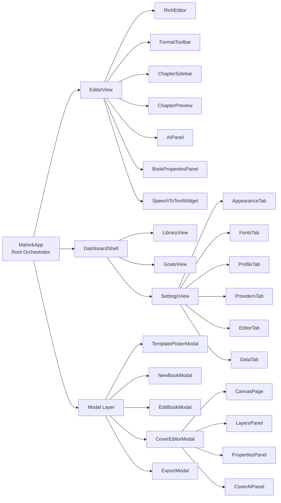
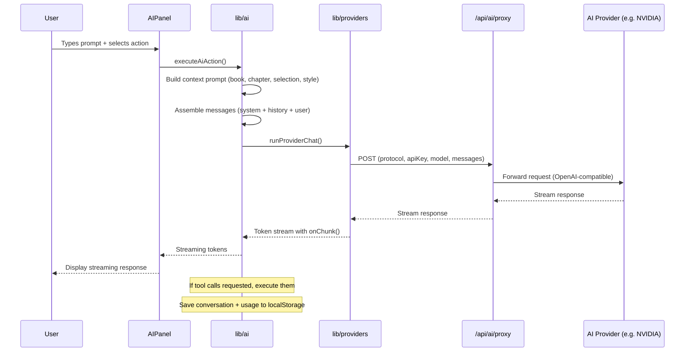
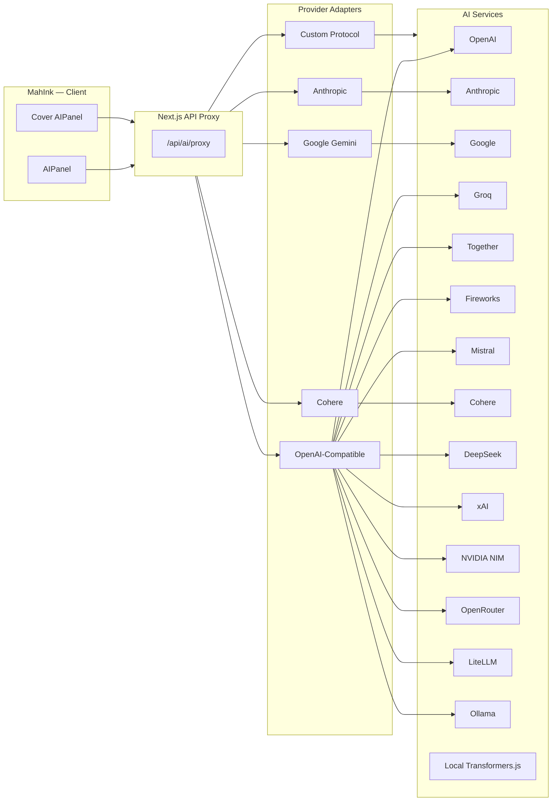

# MahInk

> A modern, browser-based book-making workspace — write, design, and export your manuscript with AI.

MahInk is a complete end-to-end book authoring platform that lives entirely in your browser. It combines a structured chapter editor, a visual cover designer, multi-provider AI assistance, professional typography controls, and a versatile export pipeline — all in one cohesive workspace. No backend database, no external subscriptions required.

---

## Table of Contents

- [Features](#features)
- [Architecture](#architecture)
- [Tech Stack](#tech-stack)
- [Getting Started](#getting-started)
- [Usage Guide](#usage-guide)
- [Export Formats](#export-formats)
- [AI Integration](#ai-integration)
- [Configuration](#configuration)
- [Data Model](#data-model)
- [Project Structure](#project-structure)
- [Contributing](#contributing)
- [License](#license)

---

## Features

### ✍️ Rich Text Editor

A full-featured TipTap-based manuscript editor with chapter management, inline formatting, custom blocks, and distraction-free writing modes.

```
┌─────────────────────────────────────────────────────────┐
│  Chapter Sidebar    │        Editor          │ Preview  │
│  ┌──────────────┐   │  ┌─────────────────┐   │          │
│  │ Ch. 1: Dawn  │   │  │ # Chapter One   │   │ Rendered │
│  │ Ch. 2: Storm │   │  │                 │   │ chapter  │
│  │ Ch. 3: Calm  │   │  │ The morning sun │   │ preview  │
│  │ Ch. 4: Rage  │   │  │ spilled across  │   │          │
│  │              │   │  │ the cobblestones │   │          │
│  └──────────────┘   │  └─────────────────┘   │          │
│                     │                        │          │
│  Desktop Layout     │   AI Panel (right)     │          │
└─────────────────────────────────────────────────────────┘
```

- **Chapter-based organization** — Add, delete, reorder, rename chapters with status tracking (Draft, In Progress, Complete, Review, Locked)
- **Rich text formatting** — Bold, italic, underline, strikethrough, color, highlight, font family, text size, align, superscript, subscript, code, blockquote, bullet lists, ordered lists, horizontal rules
- **Custom extensions** — Text background color, two-column block, drawing canvas, shape inserter
- **Focus & Zen modes** — Distraction-free writing environment
- **Typewriter sounds** — 5 audio presets (mechanical, soft, electric, classic, minimal) with configurable volume
- **Auto-save** — Debounced persistence to localStorage (configurable interval)
- **Chapter notes** — Per-chapter annotation panel
- **Snapshots** — Version checkpoints for undoing AI edits
- **Speech-to-text** — Browser-based voice input widget
- **Live preview** — Resizable right panel showing the rendered chapter

### 🎨 Cover Designer

A full canvas-based visual cover editor supporting front, spine, and back pages.

```
┌──────────────────────────────────────────────────────┐
│  Book Title                      ✕  ✓  🔄  🔍  ⛶   │
├──────────────────────┬───────────────────────────────┤
│                      │                               │
│   Layers             │     ┌─────────────────┐       │
│   ┌──────────────┐   │     │                 │       │
│   │ ▼ Background │   │     │    CANVAS       │       │
│   │   Title Text │   │     │                 │       │
│   │   Author     │   │     │   [Book Title]  │       │
│   │   Subtitle   │   │     │                 │       │
│   │   Ornament   │   │     │  [Author Name]  │       │
│   └──────────────┘   │     │                 │       │
│                      │     └─────────────────┘       │
│   Properties Panel   │                               │
│   ┌──────────────┐   │      ═══ Page: Front ═══     │
│   │ Font: Serif  │   │                               │
│   │ Size: 48px   │   │                               │
│   │ Color: #fff  │   │                               │
│   │ Opacity: 1.0 │   │                               │
│   │ Shadow: 2px  │   │                               │
│   └──────────────┘   │                               │
└──────────────────────┴───────────────────────────────┘
```

- **Three-page canvas** — Front cover, spine, and back cover
- **Element types** — Text, image, rectangle, circle, line, divider, ornament
- **Full property control** — Position, size, rotation, opacity, font family, font size, font weight, letter spacing, color, shadow (offset, blur, color), gradient fills
- **Backgrounds** — Solid color, linear gradient, radial gradient, image upload, texture overlay, vignette, pattern overlay
- **Layer management** — Reorder, show/hide, duplicate, delete elements
- **Undo/redo** — 60-step history
- **Zoom & pan** — Interactive canvas navigation
- **Snap guides** — Alignment helpers for precise positioning
- **AI-assisted design** — Chat with AI to generate or modify cover designs

### 🤖 AI Assistant

Multi-provider AI writing assistant with streaming, tool calling, and edit proposals.

```
┌─────────────────────────────────────────────┐
│  AI Assistant                          ─ □ ✕ │
├─────────────────────────────────────────────┤
│  Model: meta/llama-3.1-70b-instruct    ▼   │
│  Scope: Chapter  ▼  Action: Chat      ▼   │
├─────────────────────────────────────────────┤
│                                             │
│  ┌─────────────────────────────────────┐   │
│  │ User: Rewrite this paragraph to be │   │
│  │ more atmospheric and suspenseful.  │   │
│  └─────────────────────────────────────┘   │
│                                             │
│  ┌─────────────────────────────────────┐   │
│  │ AI: The fog crept through the      │   │
│  │ narrow alleys, muffling every      │   │
│  │ footstep as shadows danced...      │   │
│  │                                     │   │
│  │ [Accept] [Reject] [Copy] [Retry]   │   │
│  └─────────────────────────────────────┘   │
│                                             │
│  ┌─────────────────────────────────────┐   │
│  │ ⟳ Thinking... (expandable)         │   │
│  └─────────────────────────────────────┘   │
├─────────────────────────────────────────────┤
│  ┌─────────────────────────────────────┐   │
│  │ Type a message...       [📎] [↵]   │   │
│  └─────────────────────────────────────┘   │
└─────────────────────────────────────────────┘
```

- **16 supported providers** — OpenAI, Anthropic, Google Gemini, Groq, Together AI, Fireworks AI, Mistral, Cohere, DeepSeek, xAI, NVIDIA NIM, OpenRouter, LiteLLM, Ollama, Local (Transformers.js), Custom
- **Action presets** — Rewrite, Shorten, Expand, Simplify, Tone Shift, Grammar, Synonyms, Summarize, Continue, Outline, Research, Chat
- **Scope control** — Selection, Chapter, Book, Research
- **Streaming responses** — Real-time token-by-token output with expandable reasoning blocks
- **Tool calling** — AI can directly manipulate chapters, books, and settings
- **Edit proposals** — Before/after diffs with accept/reject/copy workflow
- **Auto-snapshots** — Automatic content backups before applying AI changes
- **Image attachments** — Available for vision-capable providers
- **Chat history** — Per-book, per-chapter conversation persistence
- **Token budget** — Configurable per-request, per-session, and per-month limits
- **Cost tracking** — Usage inspector with estimated costs
- **Local inference** — Run models directly in-browser via Transformers.js (no API key needed)

### 📦 Export Pipeline

| Format | Description | Method |
|--------|-------------|--------|
| **PDF** | Print-ready manuscript | Headless Chromium via browser print, configurable trim sizes (A4, A5, Letter, Trade, custom) with full typography control |
| **Audiobook (WAV)** | Text-to-speech audio | Server-side TTS via HuggingFace Transformers.js with per-segment generation and natural pauses (book title → author → chapter → sentences) |
| **Audiobook (MP4)** | Video with cover art | 1920×1080 video composited with sharp + ffmpeg — cover on left, synced text on right, TTS voiceover |
| **Markdown** | Plain text export | `.md` file with structured headings |
| **HTML** | Web-ready export | Self-contained `.html` with full document structure |
| **Cover PDF** | Individual cover pages | Front, spine, or back as separate PDFs |
| **Cover Spread** | Full wrap PDF | Front + spine + back in a single print-ready file |
| **Cover ZIP** | All cover assets | Complete cover page collection as ZIP archive |
| **KDP Cover** | Amazon-compliant PDF | Print-ready cover with proper bleed, spine width calculation, and safe margin guides |

- **KDP Compliance Validation** — Built-in checker for Amazon Kindle Direct Publishing requirements (trim size, margins, bleed, spine width, page count)
- **Progress tracking** — Real-time streaming progress bar with phase indicators during audiobook/video generation

### 📚 Library & Goals

- **Grid & list views** — Browse books visually or in compact list
- **Search & filter** — Find by title or genre
- **Writing goals** — Daily word targets with streak tracking
- **Session tracking** — Per-session word counts
- **Book statistics** — Total words, today's words, streak, total books
- **Archive** — Archive/unarchive books for organization

### 🎨 Theming & Typography

```
Themes:  Parchment  |  Slate  |  Coffee  |  Midnight  |  Paper  |  Frost  |  Ink
Editor Fonts: 31 options across Serif, Mono, Display, Sans, Cursive categories
UI Fonts: Inter, Plus Jakarta Sans, DM Sans, Manrope, Cabinet Grotesk
```

- **7 visual themes** — Each with coordinated colors, surfaces, and accents
- **31 editor fonts** — Carefully curated selection for comfortable long-form writing
- **5 UI fonts** — Clean interface typography options
- **Per-book overrides** — Each book can have its own theme, fonts, and layout
- **Per-chapter overrides** — Granular control over individual chapter styling
- **Professional typography** — Drop caps, justification, hyphenation, paragraph indentation, scene break ornaments, letter spacing, widow/orphan control

---

## Architecture

### High-Level Data Flow

```mermaid
flowchart TB
    subgraph Browser[Browser — Client Side]
        UI[MahinkApp UI]
        LS[(localStorage)]
        Editor[TipTap Editor]
        Cover[tldraw Canvas]
        AI[AI Panel]
    end

    subgraph Next[Next.js Server]
        Proxy[/api/ai/proxy]
        TTS[/api/export/audiobook]
        Video[/api/export/video]
        Models[/api/ai/models]
    end

    subgraph External[External Services]
        AI_Providers[OpenAI / Anthropic / NVIDIA / etc.]
    end

    UI <--> LS
    UI --> Editor
    UI --> Cover
    UI --> AI

    AI --> Proxy
    Proxy --> AI_Providers

    UI --> TTS
    UI --> Video
    UI --> Models
    
    TTS --> HuggingFace[HuggingFace Transformers.js]
    Video --> sharp[sharp image processing]
    Video --> ffmpeg[ffmpeg encoding]
```

### Component Architecture



### Data Flow — AI Request



---

## Tech Stack

| Category | Technology | Purpose |
|----------|-----------|---------|
| **Framework** | Next.js 16 (App Router) | React framework with file-based routing |
| **UI Library** | React 19 | Component-based user interface |
| **Language** | TypeScript 5 | Type safety across the codebase |
| **Styling** | Tailwind CSS 4 + PostCSS | Utility-first CSS framework |
| **Rich Text** | TipTap 3 (ProseMirror) | Extensible rich text editing |
| **Canvas** | tldraw 4 | Cover designer canvas rendering |
| **AI (Browser)** | HuggingFace Transformers.js 3 | Local TTS and LLM inference |
| **Audio/Video** | fluent-ffmpeg + sharp | Audiobook and video export |
| **PDF** | Chromium (headless) + Playwright | Print-ready PDF generation |
| **Icons** | Lucide React | Consistent iconography |
| **Markdown** | react-markdown + remark-gfm | AI response rendering |
| **Diff** | diff | Inline before/after edit comparison |
| **Compression** | JSZip + pako | Cover ZIP export and data compression |
| **Themes** | next-themes | Theme management |

---

## Getting Started

### Prerequisites

- **Node.js 20+** — Runtime required to run the development server
- **npm** — Package manager (included with Node.js)

### Installation

```bash
# Clone the repository
git clone https://github.com/Sidmaz666/mahink.git

# Navigate to the project directory
cd mahink

# Install dependencies
npm install
```

### Development

```bash
# Start the development server
npm run dev
```

Open [http://localhost:3000](http://localhost:3000) in your browser.

> **Note:** MahInk is a client-only application. All data is stored in `localStorage`. No database setup is required.

### Production Build

```bash
# Build the application
npm run build

# Start the production server
npm start
```

### Lint

```bash
npm run lint
```

---

## Usage Guide

### Creating Your First Book

1. Open the app at `/app`
2. Click **"Create Book"** — choose a template or start blank
3. Enter your book's title, subtitle, and genre
4. Start writing in the rich text editor

### Writing

- Use the **Chapter Sidebar** (left) to navigate between chapters
- Right-click a chapter to rename, reorder, or change its status
- Use the **Format Toolbar** (above the editor) for text formatting
- Enable **Focus Mode** or **Zen Mode** from the toolbar for distraction-free writing
- Open **Word Count** from the status bar to track progress

### Using AI

1. Go to **Settings → Providers** to configure an AI provider
2. Toggle **AI Controls** on, then **enable your provider profile**
3. Select your provider as the **Active Provider**
4. Open the **AI Panel** (right side of the editor)
5. Choose an action (Rewrite, Expand, Chat, etc.) and scope (Selection, Chapter, Book)
6. Type your prompt and press Enter
7. Review AI proposals — **Accept**, **Reject**, or **Copy** the result

### Designing a Cover

1. From the editor, open the book menu and select **"Edit Cover"**
2. Use the **Layers Panel** (left) to manage elements
3. Click on the canvas to select elements and edit properties in the **Properties Panel** (right)
4. Switch between Front, Spine, and Back pages
5. Use the AI panel for AI-assisted cover design
6. Close the editor — your design is saved automatically

### Exporting

1. Open the book menu and select **"Export"**
2. Choose your export tab:
   - **PDF** — Configure trim size, margins, and typography settings
   - **Covers** — Export individual pages or full print-ready spreads
   - **Audiobook** — Generate audio-only WAV or video MP4 with cover
   - **Text** — Export as Markdown or HTML
   - **Validation** — Run KDP compliance checks before publishing

### Managing Data

- **Settings → Data** lets you export all your data as JSON or import data from a backup
- All data is persisted in your browser's localStorage — no cloud storage by default

---

## Export Formats

### PDF Export

The PDF engine supports professional book layouts with:

```
┌─────────────────────┐
│   ┌─────────────┐   │  ← Margins (configurable)
│   │             │   │
│   │  Chapter 1  │   │  ← Drop cap
│   │             │   │
│   │ T│he morning│   │  ← Justified text
│   │  sun rose  │   │     with hyphenation
│   │  over the  │   │
│   │  distant   │   │  ← Paragraph indent
│   │  hills...  │   │
│   │             │   │
│   │    ❧       │   │  ← Scene break ornament
│   │             │   │
│   │  Later...   │   │
│   │             │   │
│   │         — 1 —│   │  ← Page number
│   └─────────────┘   │
│    Trim size: 6"×9" │
└─────────────────────┘
```

**Configurable options:**
- Trim sizes: A4, A5, Letter, Trade (6×9), US Trade (5.5×8.5), Pocket (4.25×6.87), Digest (5.5×8.5), or Custom
- Margins: top, bottom, inside, outside
- Typography: drop cap, justification, hyphenation, paragraph indent, scene break ornaments, letter spacing, widow/orphan control
- Page numbers: position (top/bottom), alignment (left/center/right), show/hide on first page
- Chapter title styles
- Front/back matter: title page, copyright page, dedication, table of contents

### Audiobook (Audio)

- **Format:** WAV (PCM, 16kHz, 16-bit, mono)
- **Voice:** Neural TTS via HuggingFace `Xenova/mms-tts-eng`
- **Structure:** Book title (1.2s pause) → "by Author" (0.8s pause) → Chapter title (0.6s pause) → Sentences (150ms between sentences, 400ms between paragraphs)
- **Generation:** Server-side, per-segment with streaming progress updates

### Audiobook (Video)

- **Resolution:** 1920×1080 (Full HD, 16:9)
- **Format:** MP4 (H.264 video, AAC audio 192kbps)
- **Composition:**
  ```
  ┌─────────────────────────────────────────────┐
  │  ┌──────────────────┐  ┌──────────────────┐  │
  │  │                  │  │  Book Title       │  │
  │  │                  │  │  by Author Name   │  │
  │  │    Cover Art     │  │                  │  │
  │  │    (fit:cover)   │  │  "The morning    │  │
  │  │                  │  │   sun spilled    │  │
  │  │                  │  │   across the     │  │
  │  │                  │  │   cobblestones   │  │
  │  │                  │  │   as the village │  │
  │  │                  │  │   stirred..."    │  │
  │  │                  │  │                  │  │
  │  └──────────────────┘  └──────────────────┘  │
  │         960px                 960px           │
  └─────────────────────────────────────────────┘
  ```
- **Features:** Per-segment frame generation with current paragraph display, synchronized TTS audio, dark ambient background with subtle cover-derived color wash, clean divider between cover and text panels

---

## AI Integration

### Provider Architecture



### Supported Providers

| Provider | Protocol | Streaming | Tools | Vision | Default Model |
|----------|----------|-----------|-------|--------|---------------|
| OpenAI | openai | ✓ | ✓ | ✓ | gpt-4.1-mini |
| Anthropic | anthropic | ✓ | ✓ | ✓ | claude-3-7-sonnet-latest |
| Google Gemini | google | ✓ | ✓ | ✓ | gemini-2.0-flash |
| Groq | openai | ✓ | ✓ | ✓ | llama-3.3-70b-versatile |
| Together AI | openai | ✓ | ✓ | ✓ | meta-llama/Llama-3.3-70B-Instruct-Turbo |
| Fireworks AI | openai | ✓ | ✓ | ✓ | accounts/fireworks/models/llama-v3p1-70b-instruct |
| Mistral | openai | ✓ | ✓ | ✓ | mistral-small-latest |
| Cohere | cohere | ✓ | ✗ | ✗ | command-r-plus |
| DeepSeek | openai | ✓ | ✓ | ✓ | deepseek-chat |
| xAI (Grok) | openai | ✓ | ✓ | ✓ | grok-3-mini |
| NVIDIA NIM | openai | ✓ | ✓ | ✓ | meta/llama-3.1-70b-instruct |
| OpenRouter | openai | ✓ | ✓ | ✓ | openai/gpt-4.1-mini |
| LiteLLM | openai | ✓ | ✓ | ✓ | gpt-4.1-mini |
| Ollama | openai | ✓ | ✓ | ✓ | llama3.2 |
| Local (Transformers.js) | openai | ✓ | ✓ | ✓ | Qwen2.5-Coder-0.5B-Instruct |
| Custom API | openai | ✓ | ✓ | ✓ | custom-model |

### AI Tools (Function Calling)

When using a provider that supports tool calling, the AI can directly manipulate:

- **`update_chapter`** — Modify chapter content, title, or status
- **`update_book`** — Modify book settings (theme, font, layout)
- **`add_chapter`** — Create a new chapter
- **`delete_chapter`** — Remove a chapter
- **`move_chapter`** — Reorder chapters
- **`select_chapter`** — Navigate to a different chapter
- **`save_snapshot`** — Create a checkpoint before edits

Cover AI tools include:
- **`list_cover_elements`** — Inspect current cover page
- **`set_cover_background`** — Change background color/gradient
- **`add_cover_element`** — Add text, image, or shape elements
- **`update_cover_element`** — Modify element properties
- **`delete_cover_element`** — Remove elements
- **`apply_cover_theme`** — Apply design presets (gothic, romance, scifi, minimal, poetry)

---

## Configuration

### Global Settings

Available in **Settings → Editor** and **Settings → Appearance**:

| Setting | Type | Default | Description |
|---------|------|---------|-------------|
| `themeId` | string | `"parchment"` | Visual theme for the entire app |
| `editorFontId` | string | `"cormorant"` | Font used in the editor |
| `uiFontId` | string | `"inter"` | Font used in the UI |
| `fontSize` | number | `17` | Editor font size in pixels |
| `lineHeight` | number | `1.75` | Editor line height (unitless) |
| `paragraphWidth` | string | `"medium"` | Editor paragraph width preset |
| `dailyGoal` | number | `500` | Daily word count goal |
| `typewriterMode` | boolean | `false` | Character-by-character text appearance |
| `autosaveInterval` | number | `2000` | Auto-save debounce in milliseconds |
| `spellingCheck` | boolean | `true` | Browser spellcheck in editor |

### AI Settings

Available in **Settings → Providers**:

| Setting | Type | Description |
|---------|------|-------------|
| `enabled` | boolean | Master AI on/off toggle |
| `activeProviderId` | string | Currently active provider profile |
| `defaultScope` | string | Default AI context scope (selection/chapter/book/research) |
| `streamResponses` | boolean | Enable real-time streaming output |
| `autoSnapshotBeforeApply` | boolean | Auto-create snapshot before AI edits |
| `allowResearchTools` | boolean | Enable AI web research capability |
| `systemPrompt` | string | Custom system prompt for all AI interactions |
| `budget.requestTokens` | number | Max tokens per AI request |
| `budget.sessionTokens` | number | Max tokens per session |
| `budget.monthlyTokens` | number | Max tokens per month |

### Book-Level Settings

Each book can override global settings:

- Theme, editor font, UI font, font size, line height, paragraph width
- Cover design (full canvas-based)
- Publishing specification (trim size, margins, paper type, binding direction, metadata)
- Editorial layout (padding, margin guides, chapter title style, page borders, page numbers)
- Professional typography (drop cap, justification, hyphenation, indentation, scene breaks, letter spacing, widow/orphan control)

---

## Data Model

The entire application state is stored as a single JSON object under the `"mahink"` key in `localStorage`.

```
localStorage["mahink"]
  ├── settings          AppSettings (global preferences)
  │   ├── authorName, authorBio
  │   ├── themeId, editorFontId, uiFontId
  │   ├── fontSize, lineHeight, paragraphWidth
  │   ├── dailyGoal, typewriterMode, focusModeDefault
  │   ├── autosaveInterval, spellingCheck
  │   └── ai (AI configuration)
  │
  ├── books[]           Array of Book
  │   ├── id, title, subtitle, genre, createdAt, updatedAt
  │   ├── visual preferences (theme, font, layout)
  │   ├── coverDesign (front/spine/back canvas)
  │   ├── publishing spec (trim, margins, metadata)
  │   ├── typography settings
  │   └── wordGoal, isArchived
  │
  ├── chapters[]        Array of Chapter
  │   ├── id, bookId, title, sortOrder, status
  │   ├── content (HTML), notes
  │   └── optional style overrides
  │
  ├── sessions[]        WritingSession (daily word count tracking)
  ├── snapshots[]       Snapshot (content version history)
  ├── aiConversations[] AiConversation (chat history)
  ├── aiUsage[]         AiUsageRecord (token/cost tracking)
  ├── aiProposals[]     AiEditProposal (pending edit proposals)
  ├── aiProviderProfiles[] AiProviderProfile (configured AI providers)
  ├── bookWorld[]       BookWorldEntry (characters, locations, terms)
  └── kdpValidations[]  ValidationResult (KDP compliance checks)
```

---

## Project Structure

```
mahink/
├── app/
│   ├── page.tsx                     # Landing / marketing page
│   ├── layout.tsx                   # Root layout with providers
│   ├── globals.css                  # Global styles + Tailwind
│   ├── api/
│   │   ├── ai/
│   │   │   ├── models/route.ts      # AI model listing endpoint
│   │   │   └── proxy/route.ts       # AI proxy (protocol translation)
│   │   └── export/
│   │       ├── audiobook/route.ts   # TTS audiobook generation
│   │       └── video/route.ts       # Video export (cover + TTS audio)
│   ├── app/
│   │   ├── page.tsx                 # Main app shell (library)
│   │   ├── [id]/page.tsx            # Book view
│   │   └── [id]/[chapterId]/page.tsx # Chapter editor
│   └── preview/
│       └── pdf/page.tsx             # PDF print preview
│
├── components/
│   ├── ModelLoadingOverlay.tsx       # AI model loading overlay
│   ├── ThemeApplier.tsx              # CSS variable injector for themes
│   └── mahink/
│       ├── MahinkApp.tsx             # Root orchestrator component
│       ├── DashboardShell.tsx        # Library/settings shell with nav
│       ├── cover/
│       │   ├── CoverAIPanel.tsx      # Cover designer AI chat
│       │   ├── CoverEditorModal.tsx  # Full cover editor modal
│       │   └── canvas/
│       │       ├── CanvasPage.tsx    # tldraw canvas for one cover page
│       │       └── ElementNode.tsx   # Custom shape renderer
│       │   └── panels/
│       │       ├── LayersPanel.tsx   # Element layer management
│       │       └── PropertiesPanel.tsx # Element property editor
│       ├── editor/
│       │   ├── AIPanel.tsx           # AI chat panel
│       │   ├── BookPropertiesPanel.tsx # Book layout controls
│       │   ├── ChapterPreview.tsx    # Live rendered preview
│       │   ├── ChapterSidebar.tsx    # Chapter navigation list
│       │   ├── ChapterTitle.tsx      # Chapter title display
│       │   ├── ChapterTitleBlock.tsx # PDF title block
│       │   ├── ChatMessageContent.tsx # AI message renderer
│       │   ├── EditorView.tsx        # Main editor layout
│       │   ├── FormatToolbar.tsx     # Text formatting toolbar
│       │   ├── MahinkDrawingView.tsx # Drawing extension viewer
│       │   ├── RichEditor.tsx        # TipTap editor wrapper
│       │   ├── SelectionAddToChatPopup.tsx # Selection-to-AI popup
│       │   ├── SpeechToTextWidget.tsx # Voice input widget
│       │   └── WebMcpBridge.tsx      # AI tool call bridge
│       ├── goals/
│       │   └── GoalsView.tsx         # Writing goals dashboard
│       ├── library/
│       │   ├── BookCard.tsx          # Grid mode book card
│       │   ├── BookRow.tsx           # List mode book row
│       │   └── LibraryView.tsx       # Main library view
│       ├── modals/
│       │   ├── EditBookModal.tsx     # Edit book details
│       │   ├── ExportModal.tsx       # Full export interface
│       │   ├── NewBookModal.tsx      # Create new book
│       │   └── TemplatePickerModal.tsx # Template selection
│       ├── settings/
│       │   ├── AppearanceTab.tsx     # Theme selection
│       │   ├── DataTab.tsx           # Data import/export
│       │   ├── EditorTab.tsx         # Editor preferences
│       │   ├── FontsTab.tsx          # Font selection
│       │   ├── ProfileTab.tsx        # Author profile
│       │   ├── ProvidersTab.tsx      # AI provider management
│       │   └── SettingsView.tsx      # Settings shell
│       └── ui/
│           ├── Book3D.tsx            # 3D book visualization
│           ├── CoverArt.tsx          # Cover art renderer
│           ├── GoalRing.tsx          # Goal progress ring
│           └── MahinkWordmark.tsx    # App logo
│
├── lib/
│   ├── ai.ts                         # AI orchestration (context building, execution)
│   ├── aiTools.ts                    # AI tool definitions and execution
│   ├── constants.ts                  # App-wide constants
│   ├── editorLayout.ts               # Editor layout helpers
│   ├── exportAudiobook.ts            # Audiobook/video export client
│   ├── exportCover.ts                # Cover export (PDF, ZIP, KDP)
│   ├── exportPdf.ts                  # PDF export client
│   ├── exportText.ts                 # Text export (Markdown, HTML)
│   ├── kdp.ts                        # KDP compliance validation
│   ├── modelLoadingStore.ts          # AI model loading state
│   ├── providers.ts                  # AI provider adapters and chat execution
│   ├── serverStore.ts                # Server-side store for export jobs
│   ├── shareUrl.ts                   # URL-based book sharing
│   ├── types.ts                      # TypeScript type definitions
│   ├── typewriterSound.ts            # Typewriter audio engine
│   └── utils.ts                      # Utility functions
│   └── editor/
│       └── extensions/
│           ├── MahinkDrawing.ts      # Drawing extension
│           ├── MahinkShape.ts        # Shape extension
│           ├── TextBackgroundColor.ts # Text background color extension
│           └── TwoColumnBlock.ts     # Two-column layout extension
│
├── public/
│   └── sounds/                       # Typewriter sound effect WAV files
│       ├── typewriter-classic.wav
│       ├── typewriter-electric.wav
│       ├── typewriter-mechanical.wav
│       ├── typewriter-minimal.wav
│       └── typewriter-soft.wav
│
├── scripts/
│   └── generate-typewriter-sounds.js # Sound generation script
│
├── types/
│   ├── global.d.ts                   # Global type declarations
│   ├── speech.d.ts                   # Web Speech API types
│   ├── tiptap-text-background.d.ts   # Text background extension types
│   └── tiptap-two-column.d.ts       # Two-column extension types
│
├── next.config.ts                    # Next.js configuration
├── package.json                      # Dependencies and scripts
├── tailwind.config.ts                # Tailwind CSS configuration
├── tsconfig.json                     # TypeScript configuration
└── postcss.config.mjs                # PostCSS configuration
```

---

## Contributing

Contributions are welcome! Here's how to get started:

1. **Fork** the repository
2. **Create a feature branch** (`git checkout -b feature/amazing-feature`)
3. **Commit your changes** (`git commit -m 'Add amazing feature'`)
4. **Push** to the branch (`git push origin feature/amazing-feature`)
5. **Open a Pull Request**

### Development Guidelines

- Follow the existing code style and conventions
- Use TypeScript for all new code
- Test your changes with `npm run build` before submitting
- Run `npm run lint` to ensure code quality
- Keep components focused and modular
- Add types for all new interfaces and data structures

---

## License

This project is licensed under the MIT License — see the [LICENSE](LICENSE) file for details.

---

*Built with Next.js, React, TipTap, tldraw, and ❤️.*
